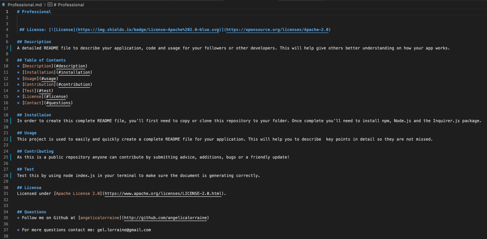

# Professional README

## License: 

## Description

A detailed README file to describe your application, code and usage for your followers or other developers. This will help give others better understanding on how your app works.

## Table of Contents

- [Description](#description)
- [Installation](#installation)
- [Usage](#usage)
- [Contribution](#contribution)
- [Test](#test)
- [License](#license)
- [Contact](#questions)

## Installaion

In order to create this complete README file, you’ll first need to copy or clone this repository to your folder. Once complete you’ll need to install npm, Node.js and the Inquirer.js package.

## Usage

This project is used to easily and quickly create a complete README file for your application. This will help you to describe key points in detail so they are not missed.

## Contributing

As this is a public repository anyone can contribute by submitting advice, additions, bugs or a friendly update!

## Test

Test this by using node index.js in your terminal to make sure the document is generating correctly.

## License

Licensed under [Apache License 2.0](https://www.apache.org/licenses/LICENSE-2.0.html).

## Questions

- Follow me on Github at [angelicalorraine](http://github.com/angelicalorraine)

- For more questions contact me: gel.lorraine@gmail.com

🎥 [Walkthrough Video](https://drive.google.com/file/d/1-MkZkyA8LZ5mUMFACunCokUpeo7PaZS3/view)

